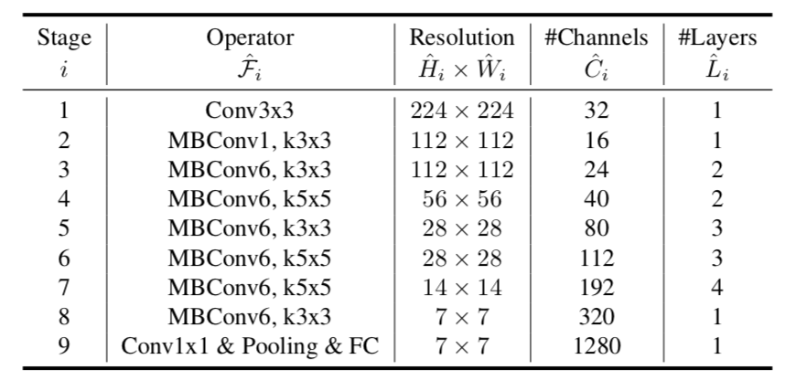

# EfficientNet-Pytorch
A PyTorch implementation of EfficientNet

# Overview
A PyTorch implementation of EfficientNet architecture: [EfficientNet: Rethinking Model Scaling for Convolutional Neural Networks](https://arxiv.org/abs/1905.11946).
Based on MobileNet-V2 and found by MNAS, EfficientNet-B0 is the baseline model to be scaled up. EfficientNet-(B1, B2, B3, B4, B5, B6, B7) are scaled up in width(channels), depth(layers), and resolution(image size).
Results: EfficientNet-B7 achieves state-of-the-art 84.4% top-1 / 97.1% top-5 accuracy on ImageNet, while being 8.4x smaller and 6.1x faster on inference than the best existing ConvNet.

# EfficientNet Architecture

# EfficientNet Results
 

# Disclaimer
Modified from official code [EfficientNets](https://github.com/tensorflow/tpu/tree/master/models/official/efficientnet).
